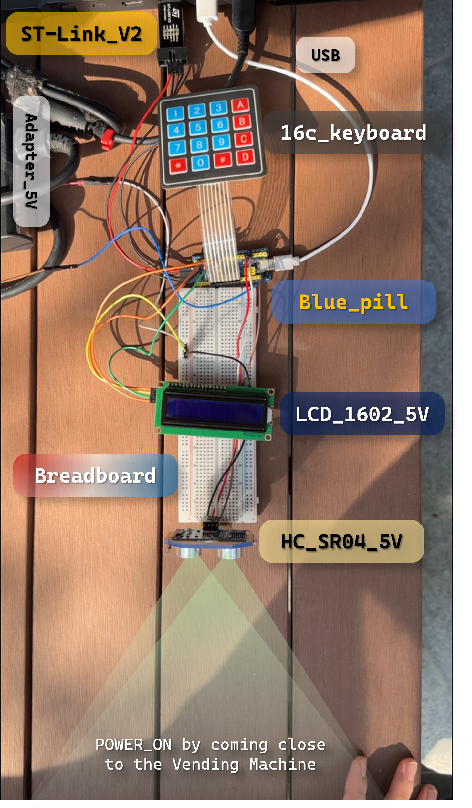

# Vending Machine System 🎮

An embedded vending machine system built on STM32F103C8T6 microcontroller for selling game skins. The system features LCD display, keypad input, ultrasonic sensor detection, and admin management capabilities.

## 📋 Table of Contents

- [Overview](#overview)
- [Features](#features)
- [Hardware Requirements](#hardware-requirements)
- [Hardware Demo](#hardware-demo)
- [Project Structure](#project-structure)
- [Getting Started](#getting-started)
- [Usage](#usage)
- [Authors](#authors)
- [References](#references)

## Overview

This project implements a complete vending machine system designed for selling in-game skins. Built using STM32 HAL libraries, it provides an interactive user interface via I2C LCD display and matrix keypad, with ultrasonic sensor for customer detection. The system includes inventory management, payment processing, and an admin mode for configuration.

## Features

- **User Interface**: 16x2 LCD display with I2C interface
- **Input System**: 4x4 matrix keypad for user interaction
- **Customer Detection**: HC-SR04 ultrasonic sensor for presence detection
- **Inventory Management**: Track quantity and price for multiple items (game skins)
- **Payment Processing**: Calculate totals and handle payment input
- **Admin Mode**: Secure access for adjusting inventory and prices
- **State Machine Architecture**: Robust FSM-based control flow
- **Error Handling**: Out-of-stock notifications, quantity limits, payment validation

## Hardware Requirements

- **Microcontroller**: STM32F103C8T6 (Blue Pill)
- **Display**: 16x2 LCD with I2C adapter (PCF8574)
- **Input**: 4x4 Matrix Keypad
- **Sensor**: HC-SR04 Ultrasonic Distance Sensor
- **Programmer**: ST-Link V2 or compatible
- **Power Supply**: 5V USB or external power

## Hardware Demo

### Physical Implementation

Below are images of the actual hardware setup showing all components connected on a breadboard:



*Complete hardware setup with labeled components*


*Controlling the system via keypad and monitoring output on LCD*

The system demonstrates:

- **Blue Pill (STM32F103C8T6)**: Main microcontroller mounted on breadboard
- **16x2 LCD Display**: Shows user interface and product information
- **4x4 Matrix Keypad**: User input for product selection and payment
- **HC-SR04 Ultrasonic Sensor**: Customer detection at the bottom
- **ST-Link V2**: Programming and debugging interface
- **Breadboard**: Prototyping platform with organized wiring
- **Power Supply**: 5V adapter for stable operation

The ultrasonic sensor at the bottom detects customer presence and automatically powers on the system when someone approaches the vending machine.

## Project Structure

```plaintext
VendingMachine/
├── LCD_TEST.ioc                    # STM32CubeMX project configuration
├── STM32F103C8TX_FLASH.ld         # Linker script
├── .cproject                       # Eclipse CDT project file
├── .mxproject                      # CubeMX project file
├── .project                        # Eclipse project file
│
├── Core/
│   ├── Inc/                        # Header files
│   │   ├── main.h                  # Main header file
│   │   ├── fsm_vm.h               # Finite State Machine definitions
│   │   ├── store.h                # Inventory management
│   │   ├── ADMIN.h                # Admin mode functions
│   │   ├── keypad.h               # Keypad driver
│   │   ├── sensor.h               # Ultrasonic sensor driver
│   │   ├── tv_lcd_i2c.h           # LCD I2C driver
│   │   ├── i2c.h                  # I2C peripheral configuration
│   │   ├── timer.h                # Timer utilities
│   │   ├── stm32f1xx_hal_conf.h   # HAL configuration
│   │   └── stm32f1xx_it.h         # Interrupt handlers
│   │
│   ├── Src/                        # Source files
│   │   ├── main.c                  # Main program entry
│   │   ├── fsm_vm.c               # FSM implementation
│   │   ├── store.c                # Inventory management implementation
│   │   ├── ADMIN.c                # Admin mode implementation
│   │   ├── keypad.c               # Keypad driver implementation
│   │   ├── sensor.c               # Sensor driver implementation
│   │   ├── tv_lcd_i2c.c           # LCD driver implementation
│   │   ├── i2c.c                  # I2C peripheral implementation
│   │   ├── timer.c                # Timer implementation
│   │   ├── stm32f1xx_hal_msp.c    # HAL MSP initialization
│   │   ├── stm32f1xx_it.c         # Interrupt service routines
│   │   ├── system_stm32f1xx.c     # System initialization
│   │   ├── syscalls.c             # System call stubs
│   │   └── sysmem.c               # Memory management
│   │
│   └── Startup/
│       └── startup_stm32f103c8tx.s # Startup assembly code
│
├── Drivers/
│   ├── CMSIS/                      # ARM CMSIS libraries
│   │   ├── Device/ST/              # STM32 device-specific files
│   │   └── Include/                # CMSIS core headers
│   │
│   └── STM32F1xx_HAL_Driver/       # STM32F1 HAL drivers
│       ├── Inc/                    # HAL header files
│       └── Src/                    # HAL source files
│
└── Debug/                          # Build output directory
    ├── LCD_TEST.hex.asm           # Disassembly output
    ├── LCD_TEST.list              # Linker list file
    ├── makefile                   # Auto-generated makefile
    └── Core/Src/                  # Compiled object files
```

## Getting Started

### Prerequisites

1. **STM32CubeIDE** (version 1.10.0 or later)
   - Download from: [https://www.st.com/en/development-tools/stm32cubeide.html](https://www.st.com/en/development-tools/stm32cubeide.html)

2. **ST-Link Drivers**
   - Included with STM32CubeIDE or download separately from ST website

### Installation & Setup

#### 1. Clone or Download the Project

```bash
git clone <repository-url>
cd VendingMachine
```

#### 2. Import Project into STM32CubeIDE

Method 1: Import Existing Project

- Open STM32CubeIDE
- Go to `File` → `Open Projects from File System...`
- Click `Directory` and select the `VendingMachine` folder
- Click `Finish`

Method 2: Import from .project file

- Open STM32CubeIDE
- Go to `File` → `Import...`
- Select `General` → `Existing Projects into Workspace`
- Click `Browse` and select the `VendingMachine` folder
- Check the project name and click `Finish`

#### 3. Configure the Project (if needed)

The project is pre-configured, but you can modify settings via:

- Open `LCD_TEST.ioc` file in STM32CubeMX
- Adjust pin configurations, peripherals, or clock settings
- Click `Generate Code` if changes are made

#### 4. Build the Project

- In STM32CubeIDE, right-click on the project
- Select `Build Project` or press `Ctrl+B`
- Wait for compilation to complete (check Console for results)

#### 5. Flash to Hardware

**Hardware Connections:**

- Connect ST-Link programmer to STM32F103C8T6:
  - SWDIO → SWDIO
  - SWCLK → SWCLK
  - GND → GND
  - 3.3V → 3.3V

**Upload Firmware:**

- Connect ST-Link to your computer via USB
- In STM32CubeIDE, click `Run` → `Debug` or `Run` → `Run`
- The firmware will be flashed automatically

### Hardware Wiring

#### LCD I2C (PCF8574)

- VCC → 5V
- GND → GND
- SDA → PB7 (I2C1_SDA)
- SCL → PB6 (I2C1_SCL)

#### 4x4 Matrix Keypad

- Connect columns and rows to GPIO pins as configured in keypad.h

#### HC-SR04 Ultrasonic Sensor

- VCC → 5V
- GND → GND
- TRIG → GPIO Output Pin
- ECHO → GPIO Input Pin (Timer Input Capture)

## Usage

### Normal Operation Mode

1. **Idle State**: System waits for customer detection via ultrasonic sensor
2. **Welcome Screen**: Displays greeting message when customer is detected
3. **Product Selection**: Use keypad to enter product ID (game skin)
4. **Quantity Selection**: Enter desired quantity
5. **Payment**: System displays total, customer enters payment amount
6. **Completion**: System displays thank you message and dispenses item

### Admin Mode

1. Press admin key combination on keypad (configured in ADMIN.c)
2. Enter admin password
3. Available options:
   - View inventory
   - Adjust product quantities
   - Update product prices
   - Exit admin mode

### State Machine Flow

```plaintext
INIT → WAIT_SENSOR → WELCOME_SECTION → CHOOSING_SKIN → DISPLAY_INFO
→ CHOOSING_QUANTITY → PAYMENT_SHOW_TOTAL → PAYMENT_INPUT → THANKS
```

Error states handle: out-of-stock, quantity errors, payment errors, and timeouts.

## Authors

- **Nguyen Hung Thinh** - *Project Development*
- **Le Thai Loc** - *Project Development*
- **Tran Doan Hoang Lam** - *FSM Design & Implementation*

**Institution**: Ho Chi Minh City University of Technology (HCMUT)

**Last Updated**: December 20, 2025

## References

### Documentation

- [STM32F103C8T6 Reference Manual](https://www.st.com/resource/en/reference_manual/cd00171190-stm32f101xx-stm32f102xx-stm32f103xx-stm32f105xx-and-stm32f107xx-advanced-arm-based-32-bit-mcus-stmicroelectronics.pdf)
- [STM32F103C8T6 Datasheet](https://www.st.com/resource/en/datasheet/stm32f103c8.pdf)
- [STM32 HAL Driver Documentation](https://www.st.com/resource/en/user_manual/dm00154093-description-of-stm32f1-hal-and-lowlayer-drivers-stmicroelectronics.pdf)

### Libraries & Tools

- **STMicroelectronics** - HAL Drivers and CMSIS
- **STM32CubeMX** - Code generation and configuration tool
- **ARM CMSIS** - Cortex Microcontroller Software Interface Standard
- **STM32CubeProgrammer** - Firmware flashing tool

### Hardware Components

- STM32F103C8T6 Microcontroller (Blue Pill)
- HC-SR04 Ultrasonic Sensor Module
- PCF8574 I2C LCD Adapter
- 16x2 Character LCD Display
- 4x4 Matrix Keypad

---

*This project is part of an academic assignment at Ho Chi Minh City University of Technology.*
